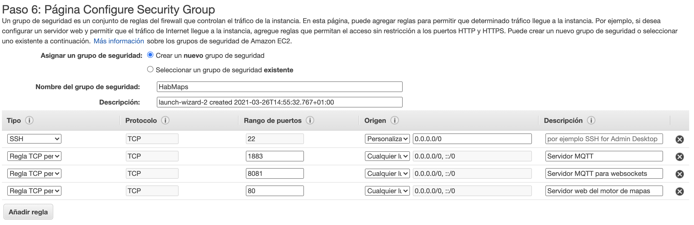

# Deploy en una maquina EC2 de Amazon

0.- Desplegamos una instancia `Ubuntu Server 20.04 LTS (HVM)` con el siguiente 
_Security Group_



1.- Nos conectamos a la maquina EC2
```
ssh -i "miubuntuone.pem" ubuntu@ec2-13-212-71-88.ap-southeast-1.compute.amazonaws.com
```

2.- Creamos el instalador haciendo un copy paste del siguiente archivo [prepare.sh](prepare.sh)

```
nano prepare.sh
```

```
chmod +x prepare.sh
```

3.- Lanzamos

```
./prepare.sh
```
