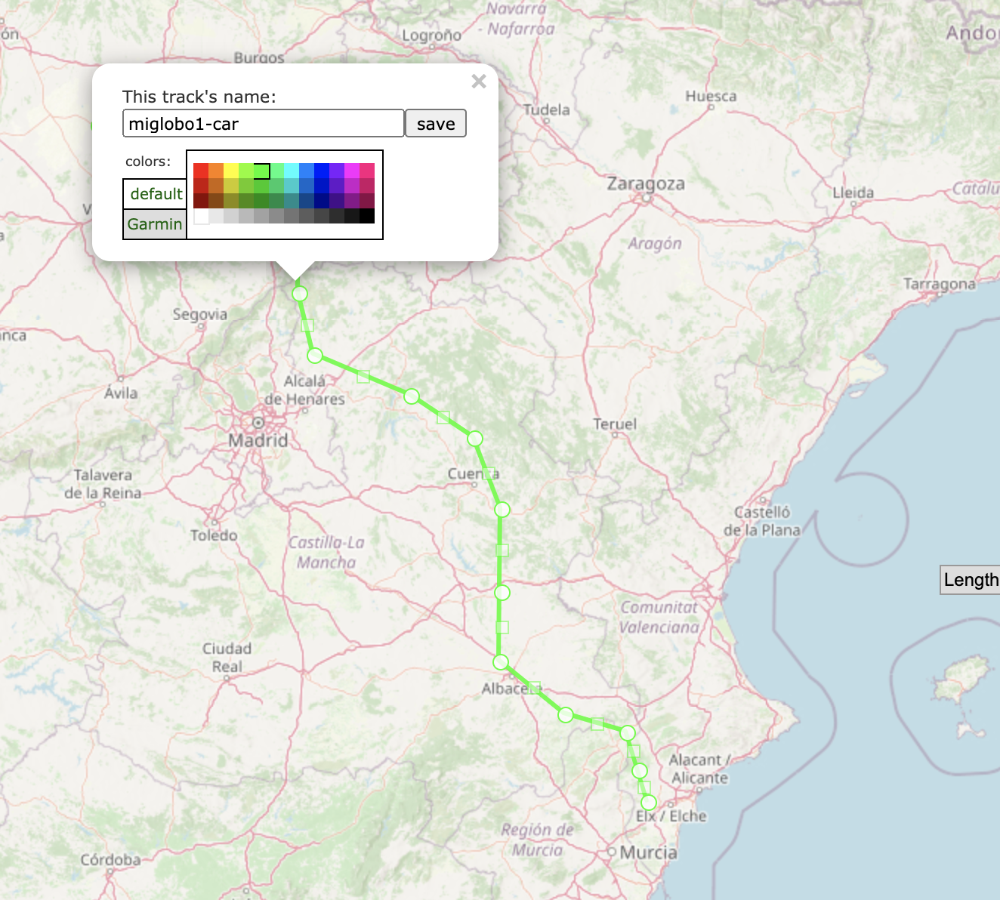

# Hab Simulator

Scripts para generar información de prueba para probar
el habmaps.

1.- Dibujamos un trazado en [https://www.gpsvisualizer.com/draw/](https://www.gpsvisualizer.com/draw/) y lo descargamos en __.gpx__

Nombramos cada traza, por ejemplo

* El globo `miglobo`
* Estación base de seguimiento 1 `miglobo-car1`
* Estación base de seguimiento 2 `miglobo-car2`

